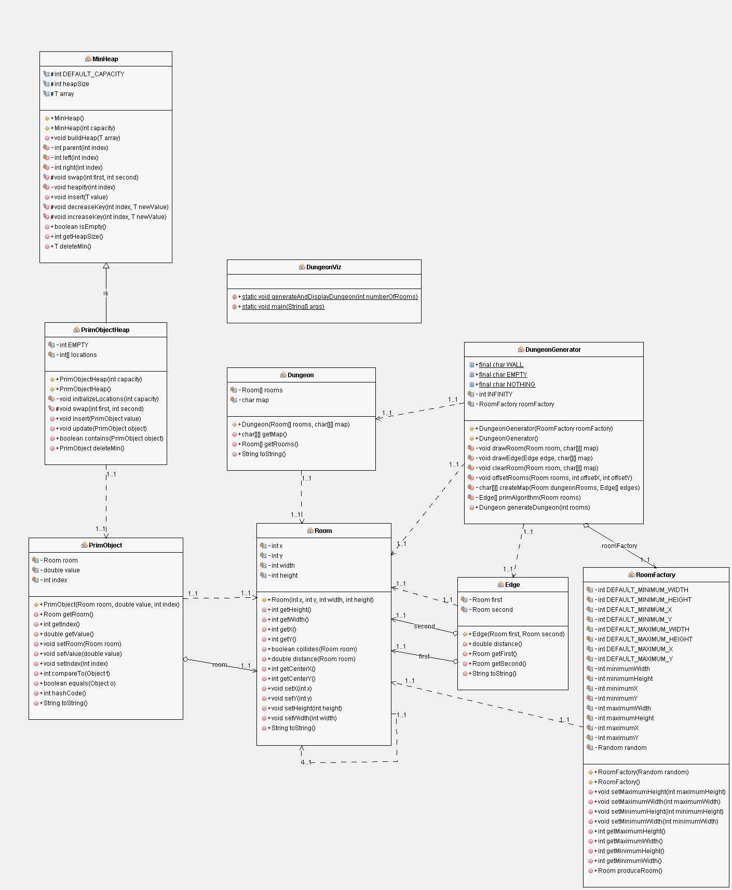

# Testausdokumentti

## Ohjelman yleisrakenne


Huone-luokka on keskeisin osa ohjelmaa, sillä sen avulla määritellään luolastot. Huomaa, isoilla kirjaimilla kirjoitetut muuttujat ovat vakioita.

## Saavutetut aika- ja tilavaativuudet (m.m. O-analyysit pseudokoodista)
> Huomaa! |V| tarkoitetaan huoneitten määrää ja |E|:llä huoneitten välisiä käytäviä.

Voidaan tarkastella itse Primmin algoritmin toteutusta luokasta `DungeonGenerator.java`:
```java
...
 private Edge[] primAlgorithm(Room rooms[]) {
        int rootIndex = 0;

        PrimObjectHeap heap = new PrimObjectHeap(rooms.length);
        PrimObject objects[] = new PrimObject[rooms.length];
        Room parent[] = new Room[rooms.length];
        
        for (int i = 0; i < rooms.length; i++) {
            parent[i] = null;
            objects[i] = new PrimObject(rooms[i], this.INFINITY, i);
        }
        objects[rootIndex].setValue(0);
        
        for (PrimObject object : objects) {
            heap.insert(object);
        }

        Edge edges[] = new Edge[rooms.length - 1];
        int edgePointer = 0;

        while (!heap.isEmpty()) {
            PrimObject currentObject = heap.deleteMin();
            
            if (parent[currentObject.getIndex()] != null) {
                Edge edge = new Edge(currentObject.getRoom(), parent[currentObject.getIndex()]);
                edges[edgePointer] = edge;
                edgePointer++;
            }

            for (int i = 0; i < objects.length; i++) {
                if (currentObject.getIndex() != i) {
                    double distance = currentObject.getRoom().distance(objects[i].getRoom());
                    if (distance < objects[i].getValue() && heap.contains(objects[i])) {
                        parent[i] = currentObject.getRoom();
                        objects[i].setValue(distance);
                        heap.update(objects[i]);
                    }
                }
            }
        }
        
        return edges;
    }
...
```

### Rivit ennen while-silmukkaa
Ensimäiset neljä riviä ovat alustusta, eli lähinnä muuttujien luontia. Sitten asetataan aloitus solmun arvoksi 0 ja muitten solmujen arvoksi ääretön. Tämän jälkeen käydään läpi foreach-silmukassa jokainen huone ja asetetaan ne minikekoon. Tämä viee aikaa `O(|V|*log(|V|))` ajan, sillä minikeon `heapify` vie logaritmisen ajan ja foreach-silmukka vie lineaarisen ajan. Sen jälkeen luodaan taulukko käytäville, joka on `|V| - 1` kokoinen, sillä tällöin jokaiselta solmulta on polku kaikkiin muihin solmuihin.

### Rivit while-silmukan sisässä

Ensin poistetaan solmu ulos minikeosta, mikä tapahtuu vakio ajassa `O(1)`. Sitten tarkastellaan, onko solmulla vanhempi, jos ei niin kyseessä on ensimmäinen käsiteltävä solmu. Mutta jos on, niin lisätään käytävä taulukkoon (`Edge[] edges`) uusi käytävä ja korotetaan `edgePointer` arvoa yhdellä. If-lausekkeen kaikki vaiheet vievät siis vakio-ajan `O(1)`. Tämän jälkeen mennään for-silmukan avulla läpi kaikki muut solmut vieden `O(|V|)` aikaa. For-silmukan sisällä olevan if-ehtolauseen tarkistus vie vakioajan, sillä `heap.contains(PrimObject object)` tarkistetaan katsomalla taulukon indeksiä ja etäisyyden laskenta on vakioaikainen. Jos If-lauseen ehto pätee, niin asetataan solmun vanhemmaksi käsittelyssä oleva solmu ja uudeksi arvoksi pienempi etäisyys (käsittelyssä olevan solmun arvo + solmujen välinen etäisyys). Sitten kutsutaan metodia `heap.update(PrimObject object)`, joka viee aikaa `O(log(|V|)`, sillä siinä kutsutaan `heapify` metodia. Tämän jälkeen while-silmukka toistetaan kunnes kaikki solmut ovat käsitelty. While-silmukka viee siis aikaa `O(|V|)`

### Johtopäätös

Täten Prim-toteutuksen aikavaativuus on ennen while-silmukkaa `O(|V|*log(|V|)` ja while-silmukan sisällä `O(|V|*|V|*log(|V|))` ja siten kokonaisaikavaativuus on `O(|V|*log(|V|) + |V|^2 * log(|V|)) = O(|V|^2*log(|V|))`


## Työn mahdolliset puutteet ja parannusehdotukset

Ohjelman raskas aikavaativuus perustuu siihen, että jokaisen huoneen välillä on aluksi kaari jokaiseen huoneeseen. Jos kaarien määrää saataisiin optimoitua, niin algoritmi saattaisi suoriutua vähemmässä ajassa kuten `O(|V|log(|V|)`. 